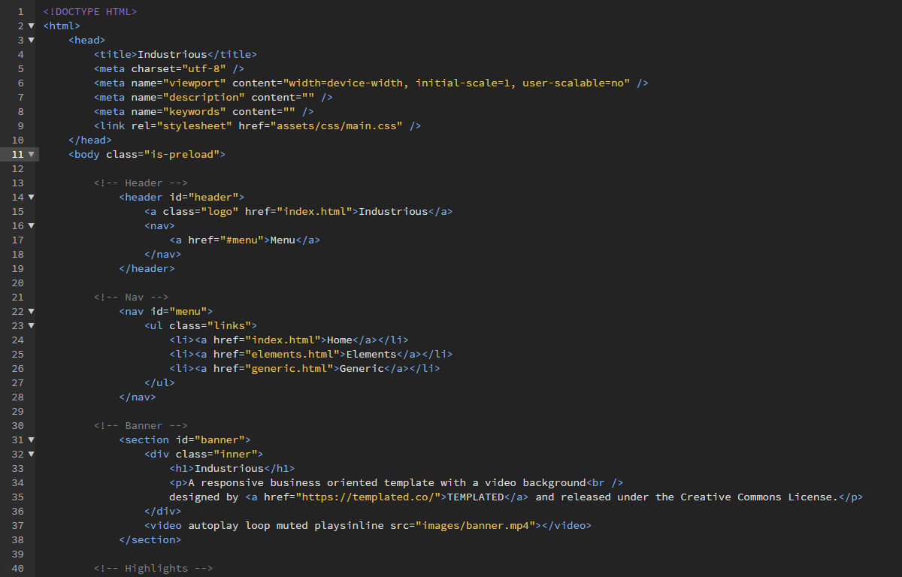
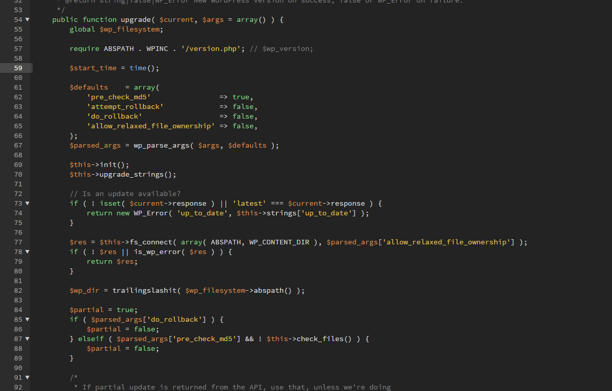
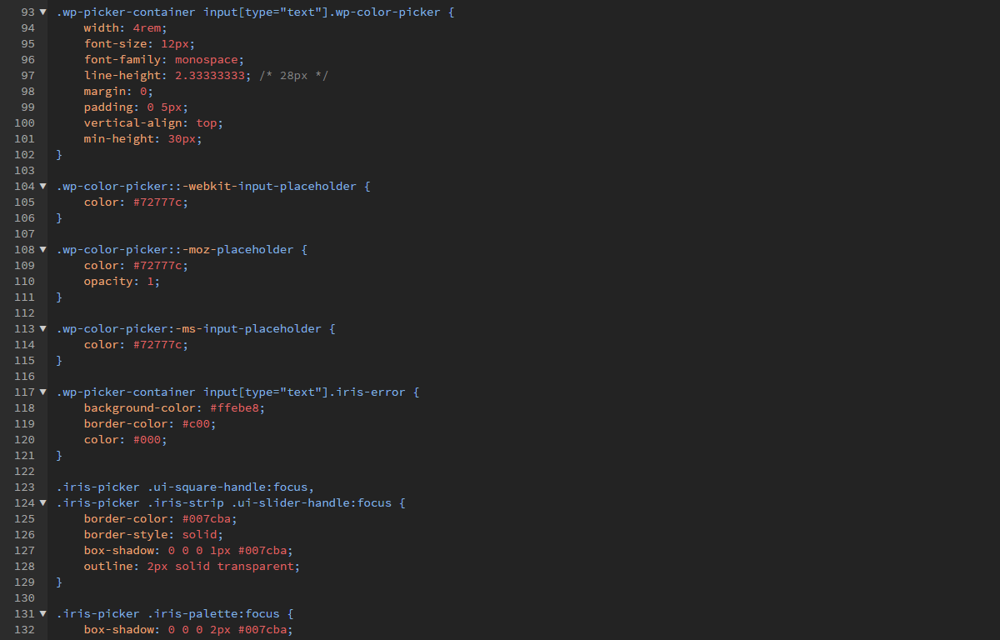
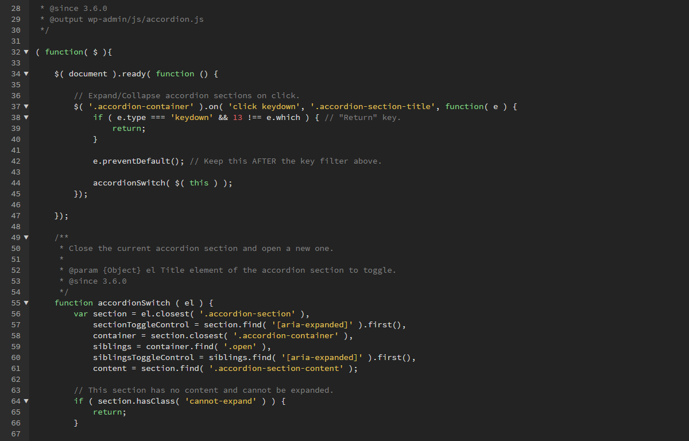

# DW Raven for Brackets - by LCweb

Dark theme matching Adobe Dreamweaver's Raven (2014 version). Contrast set to be gentle on your eyes even after ages on codes.
Hope you enjoy it as I do!

## Installation
* Open Brackets
* Open the Extension Manager
* Switch to "Themes" tab
* Search for "Raven LCweb"
* Click "Install"

## HTML

## PHP

## CSS

## JavaScript

## Copyright and License
Copyright (c) 2020 [Luca Montanari (aka LCweb)](http://www.lcweb.it). Released under the [MIT License](LICENSE).
